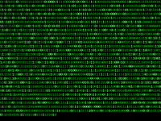

██████████████████████████████████████████████████
█░░░░░░░░░░░░░░░░░░░░░░░░░░░░░░░░░░░░░░░░░░░░░░░░█
█░ ██╗  ██╗ █████╗  ██╗  ██╗ ██████╗ ██╗  ██╗ ██████╗█
█░ ██║  ██║██╔══██╗██║ ██╔╝██╔═══██╗██║ ██╔╝██╔═══██╗█
█░ ██████╔╝███████║█████╔╝ ██║   ██║█████╔╝ ██║   ██║█
█░ ██╔═══╝ ██╔══██║██╔═██╗ ██║   ██║██╔═██╗ ██║   ██║█
█░ ██║     ██║  ██║██║  ██╗╚██████╔╝██║  ██╗╚██████╔╝█
█░ ╚═╝     ╚═╝  ╚═╝╚═╝  ╚═╝ ╚═════╝ ╚═╝  ╚═╝ ╚═════╝ █
█░░░░░░░░░░░░░░░░░░░░░░░░░░░░░░░░░░░░░░░░░░░░░░░░░░█
██████████████████████████████████████████████████





---


```markdown
```ansi

██████╗  █████╗  ██████╗██╗  ██╗███████╗
██╔══██╗██╔══██╗██╔════╝██║ ██╔╝██╔════╝
██████╔╝███████║██║     █████╔╝ █████╗  
██╔═══╝ ██╔══██║██║     ██╔═██╗ ██╔══╝  
██║     ██║  ██║╚██████╗██║  ██╗███████╗
╚═╝     ╚═╝  ╚═╝ ╚═════╝╚═╝  ╚═╝╚══════╝


# ⚡ Not-Safe-Any-System ⚡

> You’ve entered the wrong territory.  
> Tread carefully, or face consequences.

---

### 👾 About Me

I’m the shadow lurking in your system’s blind spots.  
I find what others can’t see — and exploit what others ignore.

---

### ⚠️ WARNING

This space is not for the faint-hearted.  
Any unauthorized access, probing, or tampering will be met with swift retaliation.  
You’ve been warned.

---

### 🚨 Final Word

Play smart or get out.  
I don’t chase trouble, but I’m always ready to handle it.

---

**Consider this your last warning.**  
